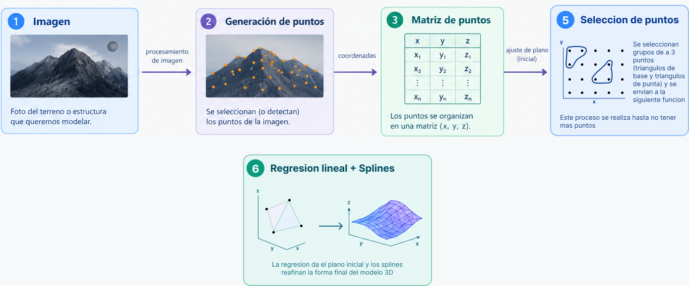

# Creación de modelos tridimensionales a partir de imágenes 2D

Este proyecto explora la reconstrucción de una superficie tridimensional a partir de una única imagen 2D.

La idea principal es transformar una imagen en un conjunto de puntos tridimensionales `(x, y, z)` y utilizar splines para aproximar y reconstruir la superficie.

## Objetivo

Construir una representación 3D de una superficie utilizando:

- Una imagen 2D como entrada.
- Estimación de profundidad.
- Generación de puntos tridimensionales.
- Regresión lineal múltiple.
- Interpolación mediante splines.
- Visualización de la superficie reconstruida.